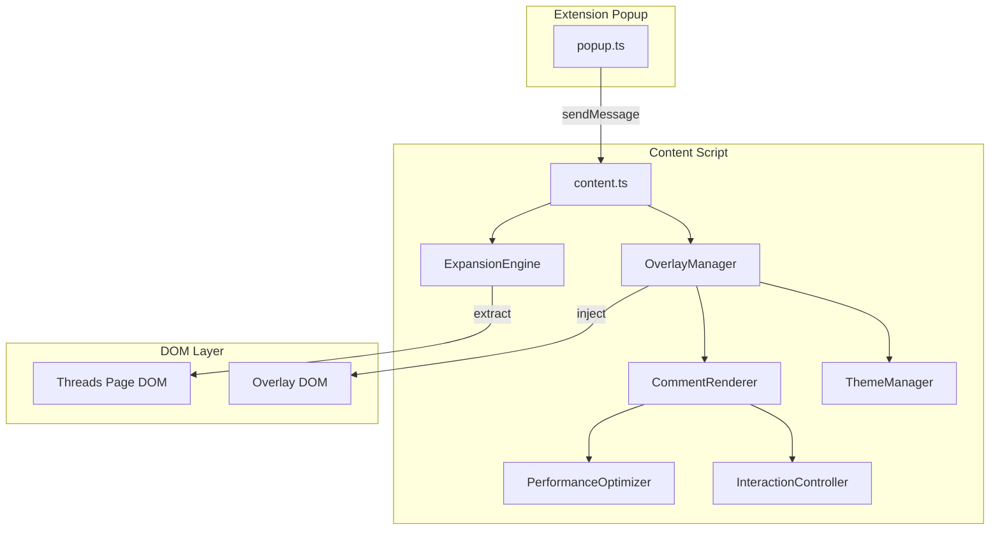
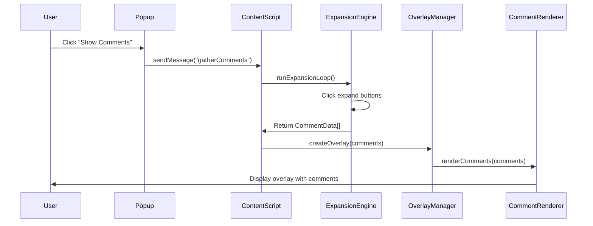
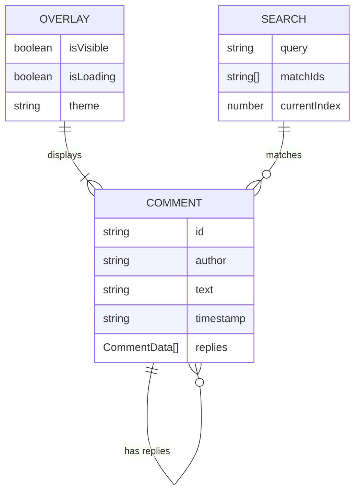

# Technical Design

## Overview

The Enhanced Comment Expansion feature transforms the existing ThreadForge comment expansion functionality into a sophisticated overlay-based visualization system. This design introduces a dedicated rendering layer that displays all Threads comments in a hierarchical, searchable interface while maintaining the existing robust expansion engine. The implementation leverages TypeScript for type safety, native DOM APIs for performance, and Chrome Extension messaging for component coordination.

## Requirements Mapping

### Design Component Traceability

Each design component directly addresses specific EARS requirements:

- **OverlayManager Component** → 1.1-1.8: Popup overlay interface requirements
- **ExpansionEngine Service** → 2.1-2.7: Comment expansion engine requirements  
- **CommentRenderer Component** → 3.1-3.8: Hierarchical comment display requirements
- **ThemeManager Service** → 4.1-4.7: Visual design and styling requirements
- **PerformanceOptimizer Service** → 5.1-5.7: Performance and error handling requirements
- **InteractionController Component** → 6.1-6.8: User controls and interactions requirements

### User Story Coverage

- **Threads user story**: OverlayManager provides full-screen overlay with centered panel
- **Content researcher story**: ExpansionEngine automates complete thread expansion
- **Discussion participant story**: CommentRenderer maintains clear parent-child hierarchy
- **User design story**: ThemeManager delivers clean, readable interface
- **Power user story**: PerformanceOptimizer handles large datasets efficiently
- **User interaction story**: InteractionController provides search and navigation

## Architecture



### Technology Stack

Based on existing ThreadForge architecture and Chrome Extension constraints:

- **Frontend**: TypeScript 5.4.5 + Native DOM APIs
- **Styling**: CSS-in-JS approach with template literals
- **Build System**: Webpack 5.91.0 with ts-loader
- **Data Management**: In-memory state with WeakMap for DOM references
- **Testing**: Jest for unit tests (future implementation)
- **Chrome APIs**: Runtime messaging, tabs API, storage API

### Architecture Decision Rationale

- **Why TypeScript**: Already in use, provides type safety for complex comment hierarchies
- **Why CSS-in-JS**: Prevents style conflicts with Threads page, ensures encapsulation
- **Why Native DOM APIs**: Minimal bundle size, no framework overhead, direct control
- **Why WeakMap**: Automatic garbage collection for DOM references, prevents memory leaks
- **Why Content Script Architecture**: Required for DOM access and manipulation on Threads

### Data Flow



## Components and Interfaces

### Core Components

#### OverlayManager
```typescript
class OverlayManager {
    createOverlay(): HTMLElement          // Creates and injects overlay DOM
    showOverlay(): void                   // Displays overlay with animation
    hideOverlay(): void                   // Hides and cleans up overlay
    setLoading(loading: boolean): void    // Shows/hides loading spinner
    attachEventListeners(): void          // Sets up close handlers
}
```

#### ExpansionEngine (Enhanced)
```typescript
class ExpansionEngine {
    findExpandElements(): HTMLElement[]                    // Locate expandable elements
    expandWithTimeout(timeout: number): Promise<void>      // Expand with 60s timeout
    extractCommentData(): CommentData[]                   // Extract structured data
    retryWithBackoff(retries: number): Promise<void>      // Exponential backoff retry
}
```

#### CommentRenderer
```typescript
class CommentRenderer {
    renderComment(comment: CommentData, depth: number): HTMLElement    // Render single comment
    renderThread(comments: CommentData[]): HTMLElement                 // Render comment tree
    collapseThread(threadId: string): void                            // Collapse thread
    expandThread(threadId: string): void                              // Expand thread
    truncateText(text: string, maxLength: number): string             // Handle long text
}
```

#### ThemeManager
```typescript
class ThemeManager {
    detectColorScheme(): 'light' | 'dark'          // Detect browser theme
    applyTheme(theme: 'light' | 'dark'): void     // Apply theme styles
    getStyles(): string                            // Get CSS string
    formatTimestamp(date: Date): string           // Format relative time
}
```

#### PerformanceOptimizer
```typescript
class PerformanceOptimizer {
    initVirtualScroll(container: HTMLElement): void       // Setup virtual scrolling
    cleanupDOMReferences(): void                         // Clear WeakMap entries
    throttleFunction(fn: Function, delay: number): Function  // Throttle helper
    measurePerformance(operation: string): void          // Performance metrics
}
```

#### InteractionController
```typescript
class InteractionController {
    initSearch(container: HTMLElement): void              // Setup search box
    filterComments(query: string): void                  // Filter by keyword
    highlightMatches(query: string): void                // Highlight search matches
    setupKeyboardNavigation(): void                      // Arrow key navigation
    copyToClipboard(text: string): void                 // Copy comment text
}
```

### Frontend Component Structure

| Component Name | Responsibility | Props/State Summary |
|----------------|---------------|-------------------|
| OverlayContainer | Root overlay element | isVisible, isLoading, comments |
| LoadingSpinner | Progress indication | progress, message |
| CommentTree | Comment hierarchy display | comments, expandedThreads, searchQuery |
| CommentNode | Individual comment | comment, depth, isExpanded, isHighlighted |
| SearchBar | Search interface | query, resultCount, currentMatch |
| ControlPanel | User controls | commentCount, hasExport |

### Message API

| Message Type | Direction | Payload | Purpose |
|-------------|-----------|---------|---------|
| gatherComments | Popup→Content | {} | Start expansion and display |
| updateProgress | Content→Popup | {progress: number} | Update progress bar |
| overlayOpened | Content→Popup | {} | Confirm overlay displayed |
| overlayClosed | Content→Popup | {} | Notify overlay closed |
| exportData | Popup→Content | {format: 'json'|'csv'} | Export comments |

## Data Models

### Domain Entities

1. **CommentData**: Core comment structure with nested replies
2. **ExpandableElement**: DOM element that can be expanded
3. **RenderState**: Current state of the rendered overlay
4. **SearchResult**: Search match information
5. **PerformanceMetrics**: Timing and memory usage data

### Entity Relationships



### Data Model Definitions

```typescript
interface CommentData {
  id: string;                    // Unique identifier
  author: string | null;          // Comment author username
  text: string | null;           // Comment text content
  timestamp: string | null;      // ISO timestamp
  replies: CommentData[];        // Nested replies
  depth?: number;                // Nesting level (calculated)
  isExpanded?: boolean;          // UI state
  matchesSearch?: boolean;       // Search state
}

interface ExpandState {
  iterationCount: number;        // Current iteration
  expandedCount: number;         // Total expanded elements
  startTime: number;            // Expansion start timestamp
  timeoutId?: number;           // Timeout reference
  status: 'idle' | 'expanding' | 'complete' | 'timeout';
}

interface OverlayState {
  isVisible: boolean;           // Overlay visibility
  isLoading: boolean;          // Loading state
  comments: CommentData[];     // All comments
  expandedThreads: Set<string>; // Expanded thread IDs
  searchQuery: string;         // Current search
  theme: 'light' | 'dark';    // Active theme
}

interface PerformanceMetrics {
  expansionDuration: number;    // Time to expand all
  renderDuration: number;       // Time to render overlay
  commentCount: number;        // Total comments
  memoryUsage: number;         // Estimated memory MB
  virtualScrollEnabled: boolean; // Performance mode active
}
```

### DOM Reference Management

```typescript
// WeakMap for automatic garbage collection
const elementDataMap = new WeakMap<HTMLElement, {
  processed: boolean;
  clickCount: number;
  lastClicked: number;
}>();

// Virtual scroll viewport tracking
interface ViewportState {
  startIndex: number;
  endIndex: number;
  scrollTop: number;
  itemHeight: number;
  containerHeight: number;
}
```

## Error Handling

### Error Categories and Strategies

```typescript
enum ErrorType {
  EXPANSION_TIMEOUT = 'EXPANSION_TIMEOUT',
  DOM_NOT_FOUND = 'DOM_NOT_FOUND',
  PARSING_ERROR = 'PARSING_ERROR',
  MEMORY_LIMIT = 'MEMORY_LIMIT',
  NETWORK_ERROR = 'NETWORK_ERROR'
}

class ErrorHandler {
  private fallbackSelectors = [
    'button[aria-label*="View replies"]',
    'button[data-testid="more-replies"]',
    'div[role="button"]:has-text("replies")'
  ];
  
  handleError(error: Error, type: ErrorType): void {
    console.error(`[ThreadForge] ${type}:`, error);
    
    switch(type) {
      case ErrorType.EXPANSION_TIMEOUT:
        this.showMessage('Expansion took too long. Displaying partial results.');
        break;
      case ErrorType.DOM_NOT_FOUND:
        this.tryFallbackSelectors();
        break;
      case ErrorType.MEMORY_LIMIT:
        this.enableVirtualScroll();
        break;
    }
  }
  
  retryWithExponentialBackoff(fn: Function, maxRetries = 3): Promise<any> {
    let delay = 1000;
    return new Promise(async (resolve, reject) => {
      for (let i = 0; i < maxRetries; i++) {
        try {
          const result = await fn();
          resolve(result);
          return;
        } catch (error) {
          if (i === maxRetries - 1) reject(error);
          await new Promise(r => setTimeout(r, delay));
          delay *= 2;
        }
      }
    });
  }
}
```

## Security Considerations

- **Content Security Policy Compliance**: All styles injected as inline styles to comply with CSP
- **XSS Prevention**: Sanitize all comment text before rendering using DOMPurify pattern
- **Isolated Execution Context**: Content script runs in isolated world
- **No External Dependencies**: Reduces supply chain attack surface
- **Input Validation**: Validate all message payloads between popup and content script
- **Rate Limiting**: Throttle expansion clicks to prevent DOS on Threads servers

## Performance & Scalability

### Performance Targets

| Metric | Target | Measurement |
|--------|--------|-------------|
| Expansion Time (100 comments) | < 30s | Timer from start to complete |
| Overlay Render Time | < 500ms | requestAnimationFrame timing |
| Memory Usage (1000 comments) | < 50MB | Chrome DevTools Memory Profiler |
| Scroll FPS | > 30fps | Chrome Performance Monitor |
| Search Response Time | < 100ms | Input to highlight timing |

### Optimization Strategies

```typescript
class PerformanceOptimizer {
  // Virtual scrolling for large comment sets
  setupVirtualScroll(container: HTMLElement, comments: CommentData[]) {
    const observer = new IntersectionObserver((entries) => {
      entries.forEach(entry => {
        if (entry.isIntersecting) {
          this.renderVisibleComments(entry.target);
        } else {
          this.unloadInvisibleComments(entry.target);
        }
      });
    });
    
    // Only render visible + buffer
    const visibleRange = this.calculateVisibleRange();
    this.renderRange(visibleRange.start, visibleRange.end);
  }
  
  // Memory management
  cleanupReferences() {
    // Clear processed element markers
    document.querySelectorAll('[data-tf-clicked]').forEach(el => {
      el.removeAttribute('data-tf-clicked');
    });
    
    // Force garbage collection hint
    if (window.gc) window.gc();
  }
  
  // Batch DOM operations
  batchDOMUpdates(updates: Function[]) {
    requestAnimationFrame(() => {
      const fragment = document.createDocumentFragment();
      updates.forEach(update => update(fragment));
      document.getElementById('tf-overlay-content')?.appendChild(fragment);
    });
  }
}
```

## Testing Strategy

### Risk Matrix

| Area | Risk | Must | Optional | Ref |
|---|---|---|---|---|
| DOM Manipulation | High | Unit, Integration | E2E | 2.1-2.7 |
| Comment Parsing | High | Unit, Property | Fuzzing | 3.1-3.8 |
| Performance | Medium | Perf smoke | Load test | 5.1 |
| Keyboard Nav | Medium | Unit, E2E | A11y | 6.8 |
| Theme Detection | Low | Unit | Visual | 4.2 |

### Test Coverage by Component

```typescript
// ExpansionEngine Tests
describe('ExpansionEngine', () => {
  test('finds all expandable elements', () => {});
  test('respects timeout limits', () => {});
  test('retries with exponential backoff', () => {});
  test('extracts nested comment data', () => {});
});

// OverlayManager Tests  
describe('OverlayManager', () => {
  test('creates overlay with correct structure', () => {});
  test('handles escape key press', () => {});
  test('maintains page scroll position', () => {});
  test('cleans up on close', () => {});
});

// PerformanceOptimizer Tests
describe('PerformanceOptimizer', () => {
  test('enables virtual scroll at 100+ comments', () => {});
  test('cleans up DOM references', () => {});
  test('batches DOM updates', () => {});
});
```

### CI Gates

| Stage | Tests | Gate | SLA |
|---|---|---|---|
| PR | Unit + Type Check | Block merge | < 2min |
| Pre-release | Integration + Perf | Block release | < 5min |
| Post-release | E2E on real Threads | Alert on fail | < 10min |

### Exit Criteria

- Zero TypeScript errors
- 80% code coverage on critical paths
- Performance targets met
- Manual QA on Threads.net passed
- No memory leaks detected