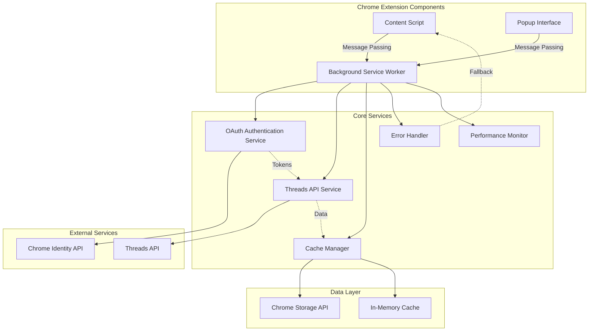
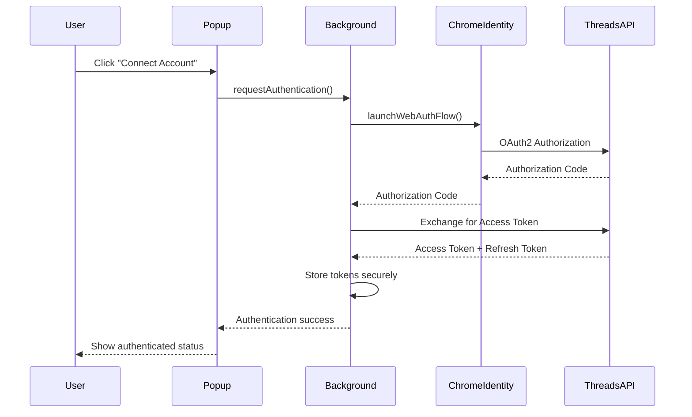
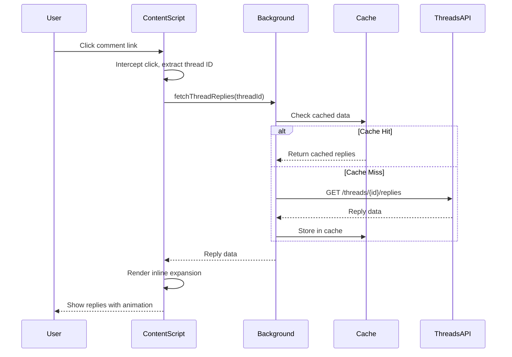
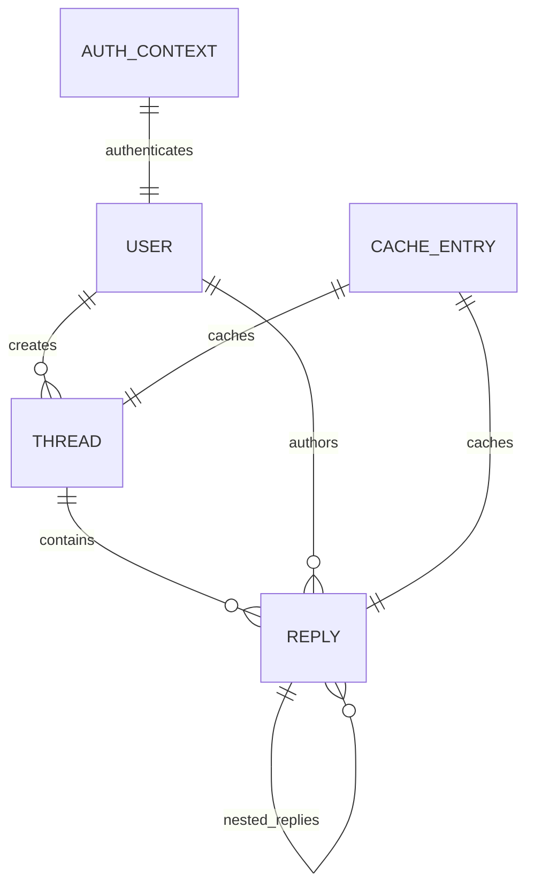

# Technical Design

## Overview

This technical design outlines the complete refactoring of ThreadForge UI Improver from a DOM-scraping based approach to using Meta's official Threads API. The refactor addresses the core limitation of incomplete nested comment expansion while maintaining the extension's core value proposition of inline comment viewing on Threads.com.

The new architecture leverages Meta's Threads API (announced June 2024, enhanced July 2025) with OAuth2 authentication, proper Chrome Extension Manifest V3 patterns, and robust caching strategies. This API-first approach provides access to complete comment thread data, reply management capabilities, and real-time engagement metrics while ensuring security and performance.

## Requirements Mapping

### Design Component Traceability
Each design component addresses specific requirements from requirements.md:

- **OAuth Authentication Service** → 2.1-2.5: Authentication Management, secure token storage
- **Background API Service** → 1.1-1.5: Threads API Integration, request handling
- **Content Script Click Interceptor** → 3.1, 3.6: Click interception and UI integration
- **Thread Data Renderer** → 3.2-3.5: Comment thread display and hierarchical rendering
- **Cache Manager** → 4.1-4.5: Data caching and storage management
- **Error Handling System** → 5.1-5.5: User feedback and error recovery
- **Settings Manager** → 6.1-6.5: Configuration and API credential management
- **Migration Service** → 7.1-7.5: Backward compatibility and fallback mechanisms
- **Performance Monitor** → 8.1-8.5: Resource management and optimization

### User Story Coverage
- **Developer Integration**: OAuth service handles API authentication and token management
- **User Authentication**: Seamless credential setup through popup interface with chrome.identity API
- **Comment Expansion**: Enhanced renderer with proper hierarchical display using API data
- **Fast Loading**: Cache manager implements LRU eviction and progressive loading
- **Error Recovery**: Comprehensive error handling with fallback to current DOM-based approach
- **Configuration**: Real-time settings application without extension restart
- **Migration**: Hybrid architecture maintains existing functionality during transition
- **Performance**: Resource monitoring and API batching for optimal browsing experience

## Architecture



### Technology Stack

Based on research findings and requirements analysis:

- **Extension Framework**: Chrome Extension Manifest V3
- **Authentication**: OAuth2 via chrome.identity API + Meta Threads OAuth
- **API Client**: Native fetch API in Background Service Worker
- **Storage**: Chrome Storage API (sync + local)
- **UI Framework**: Vanilla TypeScript (maintaining current approach)
- **Build System**: Webpack 5 with TypeScript loader
- **Testing**: Jest with Chrome Extension testing utilities

### Architecture Decision Rationale

- **Why Manifest V3 Background Service Worker**: Required for CORS-free API calls, OAuth handling, and modern Chrome extension security model
- **Why chrome.identity API**: Provides secure OAuth2 implementation specifically designed for Chrome extensions with proper token lifecycle management
- **Why Hybrid Content Script**: Maintains existing UI integration patterns while enabling message passing to background for API calls
- **Why Chrome Storage API**: Provides synchronized settings across devices and secure local caching with appropriate size limits
- **Why Native Fetch**: Manifest V3 service workers don't support XMLHttpRequest; fetch is the standard modern approach

## Data Flow

### Primary User Flows

#### Authentication Flow


#### Comment Expansion Flow


## Components and Interfaces

### Backend Services & Method Signatures

```typescript
class OAuth2AuthenticationService {
    async authenticate(): Promise<AuthenticationResult>     // Initiate OAuth2 flow
    async refreshTokens(): Promise<boolean>                 // Refresh expired tokens
    async validateCredentials(): Promise<boolean>           // Check token validity
    async revokeAccess(): Promise<void>                    // Sign out user
}

class ThreadsAPIService {
    async getThread(threadId: string): Promise<ThreadData>           // Fetch single thread
    async getThreadReplies(threadId: string): Promise<ReplyData[]>   // Fetch thread replies
    async searchThreads(query: string): Promise<SearchResult[]>      // Search threads
    async getUserProfile(userId: string): Promise<UserProfile>       // Get user info
}

class CacheManager {
    async get<T>(key: string): Promise<T | null>           // Retrieve cached data
    async set<T>(key: string, value: T, ttl: number): Promise<void>  // Store with expiration
    async invalidate(pattern: string): Promise<void>       // Clear cache entries
    async cleanup(): Promise<void>                         // LRU eviction
}

class ErrorHandlingService {
    handleAPIError(error: APIError): UserMessage           // Convert API errors
    handleNetworkError(error: NetworkError): UserMessage   // Handle connectivity issues
    handleRateLimit(error: RateLimitError): UserMessage   // Rate limit messaging
    logError(error: Error, context: string): void         // Debug logging
}
```

### Frontend Components

| Component | Responsibility | Props/State Summary |
|-----------|---------------|-------------------|
| ClickInterceptor | Detect and intercept comment clicks | { enabled: boolean, clickHandlers: Function[] } |
| ThreadRenderer | Render expanded comment threads | { replies: ReplyData[], depth: number, collapsed: boolean } |
| LoadingIndicator | Show loading states during API calls | { message: string, progress?: number } |
| ErrorBoundary | Handle rendering errors gracefully | { fallbackMessage: string, onRetry: Function } |
| AuthenticationUI | Popup authentication interface | { isAuthenticated: boolean, onAuth: Function } |
| SettingsPanel | Configuration and preferences | { settings: Settings, onUpdate: Function } |

### API Endpoints

Based on Meta Threads API documentation:

| Method | Route | Purpose | Auth | Status Codes |
|--------|-------|---------|------|--------------|
| GET | /v1.0/{user-id}/threads | List user threads | Required | 200, 401, 429, 500 |
| GET | /v1.0/{thread-id} | Get specific thread | Required | 200, 401, 404, 429, 500 |
| GET | /v1.0/{thread-id}/replies | Get thread replies | Required | 200, 401, 404, 429, 500 |
| POST | /oauth/access_token | Exchange auth code | Required | 200, 400, 401, 500 |
| GET | /v1.0/{user-id}/threads_insights | Get engagement metrics | Required | 200, 401, 429, 500 |

## Data Models

### Domain Entities

1. **ThreadData**: Represents a complete thread with metadata and content
2. **ReplyData**: Individual reply within a thread hierarchy
3. **UserProfile**: Author information and profile details
4. **AuthenticationContext**: OAuth tokens and user session state
5. **CacheEntry**: Cached data with expiration and metadata

### Entity Relationships



### Data Model Definitions

```typescript
interface ThreadData {
    id: string;
    author: UserProfile;
    text: string;
    media?: MediaAttachment[];
    replyCount: number;
    likeCount: number;
    repostCount: number;
    timestamp: Date;
    replies?: ReplyData[];
    parentThread?: string;
}

interface ReplyData {
    id: string;
    author: UserProfile;
    text: string;
    timestamp: Date;
    likeCount: number;
    parentReply?: string;
    nestedReplies?: ReplyData[];
    depth: number;
}

interface UserProfile {
    id: string;
    username: string;
    displayName: string;
    avatar?: string;
    isVerified: boolean;
}

interface AuthenticationContext {
    accessToken: string;
    refreshToken: string;
    expiresAt: Date;
    scopes: string[];
    userId: string;
}

interface CacheEntry<T> {
    data: T;
    createdAt: Date;
    expiresAt: Date;
    accessCount: number;
    key: string;
}
```

### Database Schema

Since this is a Chrome extension, data is stored using Chrome Storage API:

```typescript
// Chrome Storage Sync (cross-device settings)
interface SyncStorage {
    threadForgeSettings: ExtensionSettings;
    authenticationContext: AuthenticationContext;
    userPreferences: UserPreferences;
}

// Chrome Storage Local (device-specific cache)
interface LocalStorage {
    threadCache: Map<string, CacheEntry<ThreadData>>;
    replyCache: Map<string, CacheEntry<ReplyData[]>>;
    userCache: Map<string, CacheEntry<UserProfile>>;
    performanceMetrics: PerformanceData;
    errorLogs: ErrorLogEntry[];
}
```

### Migration Strategy

- **Phase 1**: Install new API services alongside existing DOM scraping
- **Phase 2**: Implement A/B testing between API and DOM approaches
- **Phase 3**: Gradual migration with fallback to DOM on API failures
- **Phase 4**: Complete API-only operation with DOM scraping removal

## Error Handling

### Comprehensive Error Handling Strategy

```typescript
enum ErrorType {
    AUTHENTICATION_FAILED = 'auth_failed',
    API_REQUEST_FAILED = 'api_failed',
    RATE_LIMIT_EXCEEDED = 'rate_limit',
    NETWORK_UNAVAILABLE = 'network_error',
    CACHE_CORRUPTION = 'cache_error',
    PARSING_ERROR = 'parse_error'
}

interface ErrorContext {
    type: ErrorType;
    message: string;
    recoverable: boolean;
    retryAfter?: number;
    fallbackAvailable: boolean;
    debugInfo: any;
}
```

### Error Recovery Patterns

1. **Authentication Errors**: Automatic token refresh, user re-authentication prompt
2. **API Errors**: Exponential backoff retry, fallback to DOM scraping
3. **Rate Limiting**: Respect retry-after headers, queue requests
4. **Network Errors**: Offline mode, cached data display
5. **Cache Corruption**: Automatic cache invalidation, fresh data fetch

## Security Considerations

### Security Implementation Strategy

- **OAuth2 Security**: Use chrome.identity API with PKCE for secure authentication flow
- **Token Management**: Store tokens in chrome.storage.sync with encryption for cross-device sync
- **API Communication**: All external API calls via background service worker to avoid CORS issues
- **Content Security Policy**: Strict CSP preventing inline scripts and external resource loading
- **Permission Minimization**: Request only necessary host permissions for Threads.com domains
- **Input Validation**: Sanitize all API responses before rendering in DOM
- **Rate Limit Compliance**: Implement client-side rate limiting to respect API quotas

## Performance & Scalability

### Performance Targets

| Metric | Target | Measurement |
|--------|--------|-------------|
| Comment Load Time (p95) | < 500ms | From click to display |
| Comment Load Time (p99) | < 1000ms | From click to display |
| Cache Hit Rate | > 80% | Successful cache retrievals |
| Memory Usage | < 50MB | Extension memory footprint |
| API Response Time | < 200ms | Background API requests |

### Caching Strategy

- **L1 Cache**: In-memory cache in background service worker (session-scoped)
- **L2 Cache**: Chrome storage local cache with LRU eviction (persistent)
- **Cache TTL**: Threads: 10 minutes, Replies: 5 minutes, User profiles: 1 hour
- **Cache Invalidation**: Manual refresh, user action triggers, time-based expiration
- **Cache Warming**: Preload popular threads, user's frequently accessed content

### Scalability Approach

- **Request Batching**: Combine multiple thread requests into single API call where possible
- **Progressive Loading**: Load thread summary first, then replies on demand
- **Virtual Scrolling**: For threads with 100+ replies, implement windowing
- **Background Prefetching**: Predict user actions and preload relevant data
- **Resource Monitoring**: Track memory and API quota usage with alerts

## Testing Strategy

### Risk Matrix

| Area | Risk | Must | Optional | Ref |
|------|------|------|----------|-----|
| OAuth Authentication | High | Unit, Contract, E2E | Security Penetration | 2.1-2.5 |
| Threads API Integration | High | Contract, Integration | Resilience Testing | 1.1-1.5 |
| Cache Data Integrity | Medium | Unit, Property | Performance Testing | 4.1-4.5 |
| Click Interception | Medium | E2E | Cross-browser Testing | 3.1, 3.6 |
| Error Recovery | High | Unit, Integration | Chaos Testing | 5.1-5.5 |
| Performance | Medium | Performance Smoke | Load Testing | 8.1-8.5 |

### Testing Layers

#### Unit Tests
- **OAuth Service**: Token lifecycle, refresh logic, error scenarios
- **Cache Manager**: LRU eviction, TTL expiration, data serialization
- **API Client**: Request formatting, response parsing, error handling
- **Thread Renderer**: DOM manipulation, animation timing, accessibility

#### Contract Tests
- **Threads API**: Request/response schemas, error code handling
- **Chrome APIs**: Storage, identity, messaging API contracts
- **Extension Components**: Message passing interfaces between components

#### Integration Tests
- **End-to-End OAuth Flow**: Complete authentication process
- **Cache Persistence**: Data survival across extension restarts
- **API + Cache Integration**: Cache invalidation, refresh scenarios
- **Background + Content Script**: Message passing reliability

#### End-to-End Tests (≤3 critical flows)
1. **First-time user authentication and thread expansion**
2. **Cached content display and refresh scenarios**
3. **Error recovery with fallback to DOM scraping**

### CI Gates

| Stage | Run | Gate | SLA |
|-------|-----|------|-----|
| PR | Unit + Contract | Fail = block | ≤ 5m |
| Staging | Integration + E2E | Fail = block | ≤ 15m |
| Pre-release | Performance + Security | Regression → issue | ≤ 30m |

### Exit Criteria

- All Sev1/Sev2 bugs resolved
- Unit test coverage > 85%
- All CI gates passing
- Performance targets met (see metrics above)
- Security review completed
- Chrome Web Store policy compliance verified